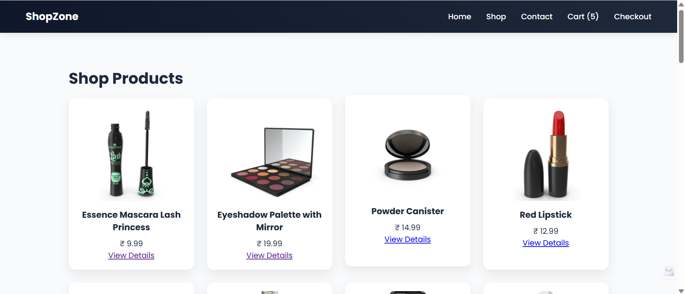

# 🛍️ ShopZone – E-Commerce Single Page Application

👉 Live URL: 

📸 Screenshot

ShopZone is a modern E-Commerce Single Page Application (SPA) built using **React JS**, **React Router**, and **Context API**.  

This project was developed as part of the ProDesk IT Internship – Week 6 Assignment.

---

## 📌 Project Objective

To build a multi-page E-Commerce frontend application that allows users to:

- Browse products
- View product details
- Add products to cart
- Manage global cart state
- Protect routes using            authentication
- Maintain cart data using localStorage

Without page reloading (Single Page Application).

---

## 🛠️ Tech Stack

- ⚛️ React JS
- 🌐 React Router DOM
- 🧠 Context API (Global State Management)
- 💾 Local Storage (Persistence)
- 🎨 CSS (Custom Styling)
- ⚡ Vite

---
## 📂 Folder Structure
src
├── components
│ ├── Navbar.jsx
│ ├── ProtectedRoute.jsx
│
├── context
│ ├── CartContext.jsx
│
├── pages
│ ├── Home.jsx
│ ├── Shop.jsx
│ ├── ProductDetails.jsx
│ ├── Cart.jsx
│ ├── Contact.jsx
│ ├── Login.jsx
│ ├── Checkout.jsx
│
├── App.jsx
├── main.jsx
├── App.css

